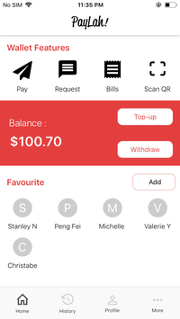
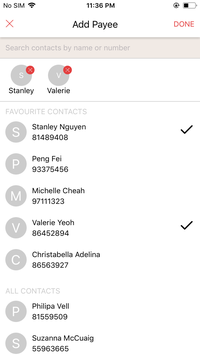
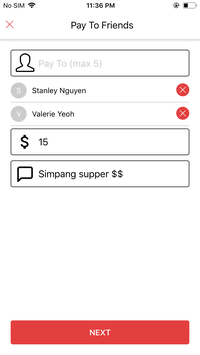
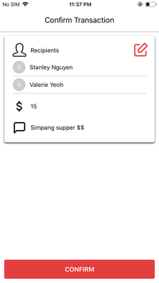
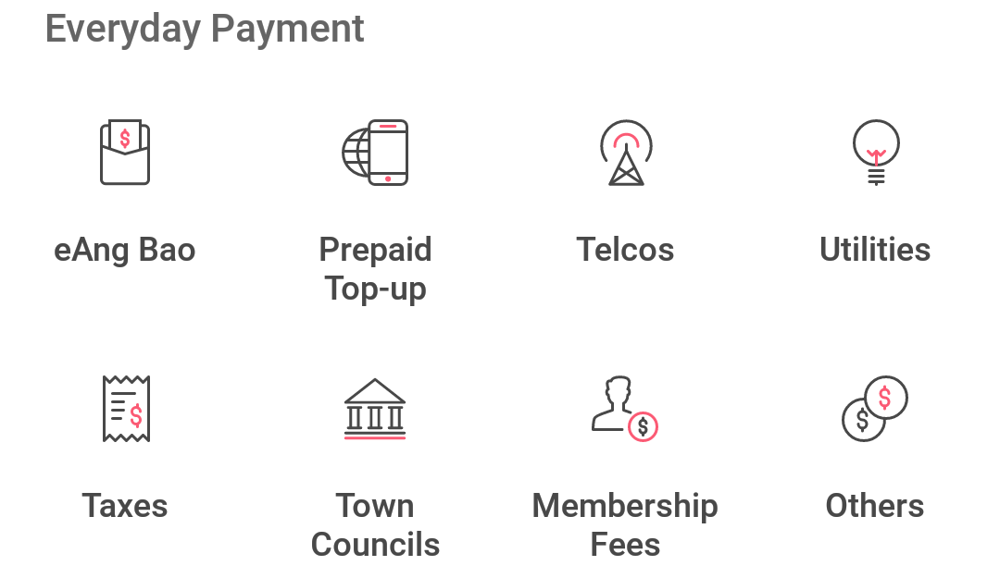
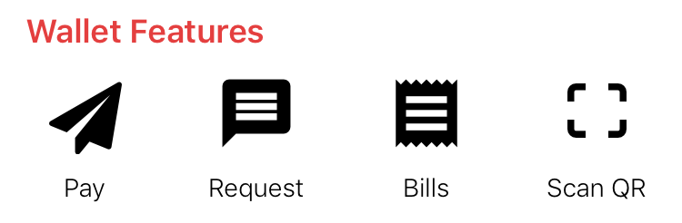
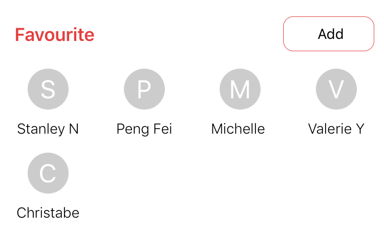

# Accessible PayLah!

Revised application UI of DBS PayLah! app with the visually handicapped target
audience in mind while maintaining the usability for the general sighted users as
well In this project, we also explored accessibility features of React Native.

### Motivation

Ever since its release in Singapore, PayLah has been very well received by
smartphone users with DBS bank account in Singapore. Unfortunately, in spite of its
popularity, PayLah used to have a bad reputation among the blind smartphone user
group. The initial release of the app was not making good use (or any at all) of
accessibility features on smartphones, in turn rendering itself unusable for the
blind users no matter how potentially useful the app can be for such user group.
Eventhough there has been a lot of improvements in terms of accessibility for
PayLah, we feel that it can be done better with more fine-grained touches on the
accessibility aspects of UI elements. Hence, we want to introduce certains
techniques/ways of doing things that can make a blind user's life better on your
app :)

### Overview

This whole React Native application is a mock up of the revised UI/UX that we want
to offer as a suggestion to DBS PayLah. The application is not functional (i.e.
user can't send money to friends) but rather interactive, painting a full
experience for users, which serves our purpose of testing and research of UI/UX
design. We only implemented (making interactable) these elements and pages that
are designed differently from the original application. Here are some screenshots
from our applications: (you can find more inside [screenshots](./screenshots)
folder)






### In-depth analysis of accessibility design

Let's dive in major things that we did differently from DBS PayLah for
accessibility features.

#### 1. Decluttering and prioritising

One problem with DBS PayLah that we found over the course of the project from
interviewing our target user group is that the UI is often very cluttered with
functionalities hence UI elements, and often times, those elements (with different
visual cues and labels) all lead to the same functionalities/page. For example, on
original PayLah app's home page:


<br/>_All of these buttons lead to bill payment page_

This might be intended by the designers of the original app from DBS to educate
users about the capabilities of the app etc. However, as there are now more UI
elements with various labels on the screen, the learning curve for our blind
target user group is steeper. In our opinion, the benefit of having all this
"educating" elements does not justify the trouble for blind users. So we decided
to revamp and remove/hide unneccessary elements, and replaced with more purposeful
elements for useful features like "Favourites"


<br/>_We changed the items in Key Features menu into more frequently used features and order them by frequency of usage_


<br/>_We added favorite shortcuts to home screen to make better use of avaialble space_

#### 2. More meaningful and appropriately dynamic accessibility labels

Often times, developers find it tedious to label item by item so the labels are
usually just fixed strings that describe specific elements (or even none at all!).
Nevertheless, as peer application designers and developers, we urge everyone to
pay more attention to labelling because it's critical for a blind person using your
app. We hypothesized that the tedious aspect of coming up with labels is due to
the lack of guidance in this area so we came up with a 3-question framework that
(might) help other developers in this task, and eventually blind phone users:

1.  What can our users do
1.  What are our users doing
1.  What have our users not done

In addition, for this specific experiments, we also attempted to put in a bit more
"thoughts" into the labels by using logic to make the labels more "aware" of the
pages'/elements' states. For example, this is how we label our NEXT button on Pay
page

```js
accessibilityLabel={
  this.state.payees.length === 0
    ? 'Disabled next button, please choose one or more payee'
    : !this.state.amount
      ? 'Disabled next button, please enter amount'
      : 'Next'
}
```

We found React Native with Javascript's inline logic gates pretty elegant for this
task. Nevertheless, we believe that it is definitely possible to achieve the same
experience with other tools and it's just a matter of effort from the dev team. We
hope to be a good example and influence more developers to pay attention to this.

#### 3. Default page starting point

Another accessibility feature that we implemented during this experiement is
"Default starting point". We found that often times, when blind users first access
a page (or even multiple times afterwards), they are not aware of the page layout
and possibly purpose so they would take some time to explore the page before
starting to actually use it. As a result, we decided to make the top title of
every page to have very detailed label that provide context to users by briefly
describing purpose and layout of the page and make such title to be the first-index
element item on the page, which will be automatically focused by screen reader on
page mounted. This has proven useful by helping our test users learn faster and use
the app with greater efficiency during our experiment.

#### 4. Non-focusable elements and grouping of elements

Last but not least, eventhough this problem might have been addressed before and
in multiple guidelines by Apple or Google, developers often forget to "hide"
(making non-focusable) items that are not very useful to the blind user group like
visual icons etc. We want to stress this practice again to whoever that are reading
about our experiment to always group visual cues together with the related text
label, or label such item if there's no text label or hide them if there's no extra
neccessary information intended for blind users.

### Final notes

Firstly, we would like to pay gratitude to DBS developer team for their effort in
making such an useful app and having revised the UI (in these recent updates with
the new look) to make it better for blind users. We hope that our experiment can
provide some interesting techniques to make the PayLah app even better for the
blind so that the team can refer to and be inspired to improve to greater extend.

On the other hand, despite the fact that we are specifically basing our experiement
and research on DBS PayLah and P2P mobile payment, we would not want the influence
of this experiment to stop there. We would like to say that these above mentioned
major points are actually not exclusive for just PayLah or mobile payment or even
mobile but they are for every piece of software that is ever written. If you are a
developer, be it web, mobile or desktop applications, who is reading this, we hope
that this will inspire you to do more good by making your software more inclusive.
